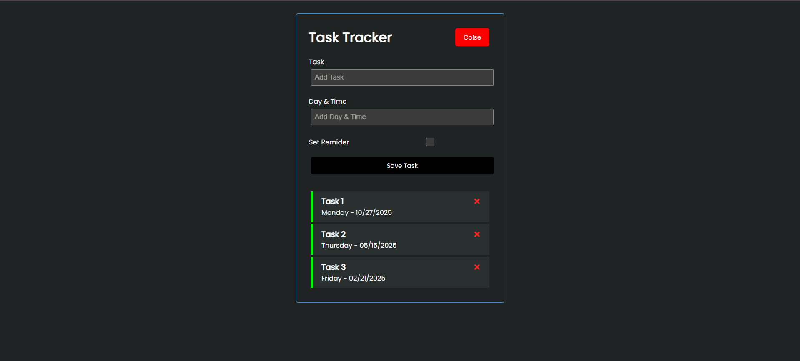

---

# 📝 Task Tracker

## Task Tracker is a simple yet powerful React application that allows users to **add, delete, and set reminders** for their tasks. It helps you stay organized and keep track of your daily activities efficiently.

## 🚀 Features

- ➕ **Add Tasks:** Quickly add new tasks with a title, date and optional reminder.
- ❌ **Delete Tasks:** Remove tasks you’ve completed or no longer need.
- ⏰ **Set Reminders:** Highlight important tasks by double clicking on the tasks.
- ⚡ **Responsive Design:** Works smoothly on all devices — desktop or mobile.
- ⚛️ **Built with React:** Uses functional components and React Hooks.

---

## 🛠️ Technologies Used

- **React** – for building the UI
- **JavaScript (ES6+)** – logic and functionality
- **CSS** – for styling and layout

---

## 💡 How to Use

1. Clone this repository:
   ```bash
   git clone https://github.com/leosharifi/Task-Tracker.git
   ```
2. Navigate to the project folder:
   ```bash
   cd task-tracker
   ```
3. Install the dependencies:
   ```bash
   npm install
   ```
4. Run the app locally:
   ```bash
   npm start
   ```
